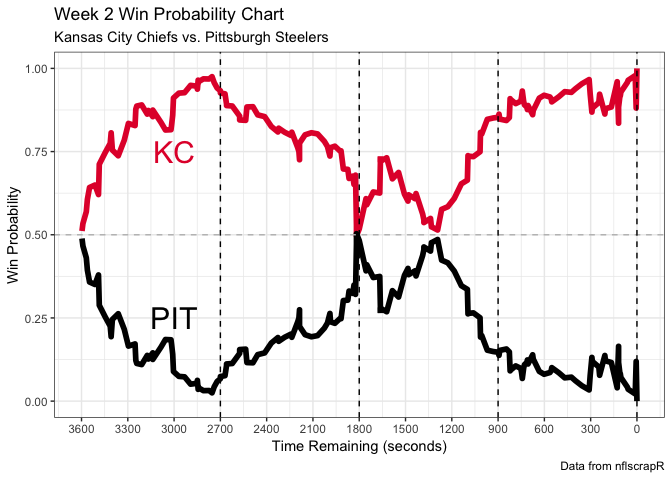

<!-- README.md is generated from README.Rmd. Please edit that file -->
Introducing the `nflscrapR` Package
===================================

This package was built to allow R users to utilize and analyze data from
the National Football League (NFL) API. The functions in this package
allow users to perform analysis at the play and game levels on single
games and entire seasons. By parsing the play-by-play data recorded by
the NFL, this package allows NFL data enthusiasts to examine each facet
of the game at a more insightful level. The creation of this package
puts granular data into the hands of any `R` user with an interest in
performing analysis and digging up insights about the game of American
football. With open-source data, the development of reproducible
advanced NFL metrics can occur at a more rapid pace and lead to growing
the football analytics community.

*Note: Data is only available after 2009… for now*

Installation
============

``` r
# Must install the devtools package using the below commented out code
# install.packages("devtools")

# Then can install using the devtools package from either of the following:
devtools::install_github(repo = "maksimhorowitz/nflscrapR")
# or the following (these are the exact same packages):
devtools::install_github(repo = "ryurko/nflscrapR")
```

Gather game ids
===============

Using the `scrape_game_ids` function, one can easily access all pre-,
post-, and regular season games for a specified season as well as
options for the week and teams. The code below returns a dataframe
containing the games for week 2 of the 2018 NFL season:

``` r
# First load the package:
library(nflscrapR)
#> Loading required package: nnet
#> Loading required package: magrittr

week_2_games <- scrape_game_ids(2018, weeks = 2)
#> Loading required package: XML
#> Loading required package: RCurl
#> Loading required package: bitops
# Display using the pander package:
# install.packages("pander")
week_2_games %>%
  pander::pander()
```

<table>
<colgroup>
<col style="width: 9%" />
<col style="width: 17%" />
<col style="width: 16%" />
<col style="width: 16%" />
<col style="width: 9%" />
<col style="width: 12%" />
<col style="width: 20%" />
</colgroup>
<thead>
<tr class="header">
<th style="text-align: center;">type</th>
<th style="text-align: center;">game_id</th>
<th style="text-align: center;">home_team</th>
<th style="text-align: center;">away_team</th>
<th style="text-align: center;">week</th>
<th style="text-align: center;">season</th>
<th style="text-align: center;">state_of_game</th>
</tr>
</thead>
<tbody>
<tr class="odd">
<td style="text-align: center;">reg</td>
<td style="text-align: center;">2018091300</td>
<td style="text-align: center;">CIN</td>
<td style="text-align: center;">BAL</td>
<td style="text-align: center;">2</td>
<td style="text-align: center;">2018</td>
<td style="text-align: center;">POST</td>
</tr>
<tr class="even">
<td style="text-align: center;">reg</td>
<td style="text-align: center;">2018091600</td>
<td style="text-align: center;">ATL</td>
<td style="text-align: center;">CAR</td>
<td style="text-align: center;">2</td>
<td style="text-align: center;">2018</td>
<td style="text-align: center;">POST</td>
</tr>
<tr class="odd">
<td style="text-align: center;">reg</td>
<td style="text-align: center;">2018091608</td>
<td style="text-align: center;">WAS</td>
<td style="text-align: center;">IND</td>
<td style="text-align: center;">2</td>
<td style="text-align: center;">2018</td>
<td style="text-align: center;">POST</td>
</tr>
<tr class="even">
<td style="text-align: center;">reg</td>
<td style="text-align: center;">2018091607</td>
<td style="text-align: center;">TEN</td>
<td style="text-align: center;">HOU</td>
<td style="text-align: center;">2</td>
<td style="text-align: center;">2018</td>
<td style="text-align: center;">POST</td>
</tr>
<tr class="odd">
<td style="text-align: center;">reg</td>
<td style="text-align: center;">2018091606</td>
<td style="text-align: center;">TB</td>
<td style="text-align: center;">PHI</td>
<td style="text-align: center;">2</td>
<td style="text-align: center;">2018</td>
<td style="text-align: center;">POST</td>
</tr>
<tr class="even">
<td style="text-align: center;">reg</td>
<td style="text-align: center;">2018091605</td>
<td style="text-align: center;">PIT</td>
<td style="text-align: center;">KC</td>
<td style="text-align: center;">2</td>
<td style="text-align: center;">2018</td>
<td style="text-align: center;">POST</td>
</tr>
<tr class="odd">
<td style="text-align: center;">reg</td>
<td style="text-align: center;">2018091604</td>
<td style="text-align: center;">NYJ</td>
<td style="text-align: center;">MIA</td>
<td style="text-align: center;">2</td>
<td style="text-align: center;">2018</td>
<td style="text-align: center;">POST</td>
</tr>
<tr class="even">
<td style="text-align: center;">reg</td>
<td style="text-align: center;">2018091601</td>
<td style="text-align: center;">BUF</td>
<td style="text-align: center;">LAC</td>
<td style="text-align: center;">2</td>
<td style="text-align: center;">2018</td>
<td style="text-align: center;">POST</td>
</tr>
<tr class="odd">
<td style="text-align: center;">reg</td>
<td style="text-align: center;">2018091602</td>
<td style="text-align: center;">GB</td>
<td style="text-align: center;">MIN</td>
<td style="text-align: center;">2</td>
<td style="text-align: center;">2018</td>
<td style="text-align: center;">POST</td>
</tr>
<tr class="even">
<td style="text-align: center;">reg</td>
<td style="text-align: center;">2018091603</td>
<td style="text-align: center;">NO</td>
<td style="text-align: center;">CLE</td>
<td style="text-align: center;">2</td>
<td style="text-align: center;">2018</td>
<td style="text-align: center;">POST</td>
</tr>
<tr class="odd">
<td style="text-align: center;">reg</td>
<td style="text-align: center;">2018091610</td>
<td style="text-align: center;">SF</td>
<td style="text-align: center;">DET</td>
<td style="text-align: center;">2</td>
<td style="text-align: center;">2018</td>
<td style="text-align: center;">POST</td>
</tr>
<tr class="even">
<td style="text-align: center;">reg</td>
<td style="text-align: center;">2018091609</td>
<td style="text-align: center;">LA</td>
<td style="text-align: center;">ARI</td>
<td style="text-align: center;">2</td>
<td style="text-align: center;">2018</td>
<td style="text-align: center;">POST</td>
</tr>
<tr class="odd">
<td style="text-align: center;">reg</td>
<td style="text-align: center;">2018091612</td>
<td style="text-align: center;">JAX</td>
<td style="text-align: center;">NE</td>
<td style="text-align: center;">2</td>
<td style="text-align: center;">2018</td>
<td style="text-align: center;">POST</td>
</tr>
<tr class="even">
<td style="text-align: center;">reg</td>
<td style="text-align: center;">2018091611</td>
<td style="text-align: center;">DEN</td>
<td style="text-align: center;">OAK</td>
<td style="text-align: center;">2</td>
<td style="text-align: center;">2018</td>
<td style="text-align: center;">POST</td>
</tr>
<tr class="odd">
<td style="text-align: center;">reg</td>
<td style="text-align: center;">2018091613</td>
<td style="text-align: center;">DAL</td>
<td style="text-align: center;">NYG</td>
<td style="text-align: center;">2</td>
<td style="text-align: center;">2018</td>
<td style="text-align: center;">POST</td>
</tr>
<tr class="even">
<td style="text-align: center;">reg</td>
<td style="text-align: center;">2018091700</td>
<td style="text-align: center;">CHI</td>
<td style="text-align: center;">SEA</td>
<td style="text-align: center;">2</td>
<td style="text-align: center;">2018</td>
<td style="text-align: center;">POST</td>
</tr>
</tbody>
</table>

Example play-by-play analysis
=============================

Here is an example of scraping the week 2 matchup of the 2018 NFL season
between the Kansas City Chiefs and the Pittsburgh Steelers. First,
access the `tidyverse` library to select the game id and then use the
`scrape_json_play_by_play` function to return the play-by-play data for
the game:

``` r
# install.packages("tidyverse")
library(tidyverse)
#> ── Attaching packages ──────────────────────────────────────────────────────────────────────────── tidyverse 1.2.1 ──
#> ✔ ggplot2 3.0.0     ✔ purrr   0.2.5
#> ✔ tibble  1.4.2     ✔ dplyr   0.7.6
#> ✔ tidyr   0.8.1     ✔ stringr 1.3.1
#> ✔ readr   1.1.1     ✔ forcats 0.3.0
#> Warning: package 'dplyr' was built under R version 3.5.1
#> ── Conflicts ─────────────────────────────────────────────────────────────────────────────── tidyverse_conflicts() ──
#> ✖ tidyr::complete()  masks RCurl::complete()
#> ✖ tidyr::extract()   masks magrittr::extract()
#> ✖ dplyr::filter()    masks stats::filter()
#> ✖ dplyr::lag()       masks stats::lag()
#> ✖ purrr::set_names() masks magrittr::set_names()

# Now generate the play-by-play dataset for the game:
kc_vs_pit_pbp <- week_2_games %>%
  filter(home_team == "PIT") %>%
  pull(game_id) %>%
  scrape_json_play_by_play()
```

Now using the estimates from the `nflscrapR` [expected points and win
probability models](https://arxiv.org/abs/1802.00998) we can generate
visuals summarizing the game. For example the win probability chart
below shows how the Chiefs early lead faded in the second quarter,
before they took sealed the game in the second half:

``` r
# Install the awesome teamcolors package by Ben Baumer and Gregory Matthews:
# install.packages("teamcolors")
library(teamcolors)

# Pull out the Steelers and Chief colors:
nfl_teamcolors <- teamcolors %>% filter(league == "nfl")
pit_color <- nfl_teamcolors %>%
  filter(name == "Pittsburgh Steelers") %>%
  pull(primary)
kc_color <- nfl_teamcolors %>%
  filter(name == "Kansas City Chiefs") %>%
  pull(primary)

# Now generate the win probability chart:
kc_vs_pit_pbp %>%
  filter(!is.na(home_wp),
         !is.na(away_wp)) %>%
  dplyr::select(game_seconds_remaining,
                home_wp,
                away_wp) %>%
  gather(team, wpa, -game_seconds_remaining) %>%
  ggplot(aes(x = game_seconds_remaining, y = wpa, color = team)) +
  geom_line(size = 2) +
  geom_hline(yintercept = 0.5, color = "gray", linetype = "dashed") +
  scale_color_manual(labels = c("KC", "PIT"),
                     values = c(kc_color, pit_color),
                     guide = FALSE) +
  scale_x_reverse(breaks = seq(0, 3600, 300)) + 
  annotate("text", x = 3000, y = .75, label = "KC", color = kc_color, size = 8) + 
  annotate("text", x = 3000, y = .25, label = "PIT", color = pit_color, size = 8) +
  geom_vline(xintercept = 900, linetype = "dashed", black) + 
  geom_vline(xintercept = 1800, linetype = "dashed", black) + 
  geom_vline(xintercept = 2700, linetype = "dashed", black) + 
  geom_vline(xintercept = 0, linetype = "dashed", black) + 
  labs(
    x = "Time Remaining (seconds)",
    y = "Win Probability",
    title = "Week 2 Win Probability Chart",
    subtitle = "Kansas City Chiefs vs. Pittsburgh Steelers",
    caption = "Data from nflscrapR"
  ) + theme_bw()
```



Example of gathering season data
================================

You can also use the `scrape_season_play_by_play` function to scrape all
the play-by-play data meeting your desired criteria for particular
season. Note that this function can take a long time to run due to
pulling potentially an entire season’s worth of data. The code below
demonstrates how to access all play-by-play data from the 2018
pre-season:

``` r
preseason_pbp_2018 <- scrape_season_play_by_play(2018, "pre")
```
