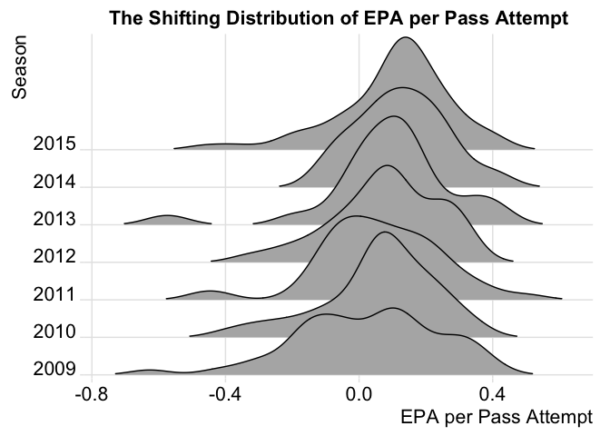

<!-- README.md is generated from README.Rmd. Please edit that file -->
Introducing the nflscrapR Package
=================================

This package was built to allow R users to utilize and analyze data from the National Football League (NFL) API. The functions in this package allow users to perform analysis at the play and game levels on single games and entire seasons. By parsing the play-by-play data recorded by the NFL, this function allows NFL data enthusaists to examaine each facet of the game at a more insightful level. The creation of this package puts granular data into the hands of the any R user with an interest in performing analysis and digging up insights about the game of American Football. With this data, the development of advanced NFL metrics can occur at a more rapid pace helping influence NFL teams to use data driven insights within player operations.

*italic* Note: Data is only available after 2009

Downloading and Loading the Package
===================================

``` r
# Must install the devtools package using the below commented out code
# install.packages("devtools")
library(devtools)

# For now you must install it from github
if (!is.element("nflscrapR",installed.packages())) {
  # Print Installing nflscrapR
  devtools::install_github(repo = "maksimhorowitz/nflscrapR")
}

library(nflscrapR)
```

Simple Example of Package Usage
===============================

Here is an example of comparing the difference in the distributions of yards per attempt for passers with over 35 attempts between the 2009 and 2015 NFL seasons. The code for this example is below:

``` r
# Loading the Data with season_playergame function
# Note the season_playergame function takes a few minutes to run

players2009 <- season_playergame(2009)
#> Loading required package: XML
#> Loading required package: RCurl
#> Loading required package: bitops
players2015 <- season_playergame(2015)

# Arbitrary cut off for QBs to remove punts and other position players who threw passes
qbs2009 <- subset(players2009, pass.att > 30)
qbs2015 <- subset(players2015, pass.att > 30)

# Yards Per Attempt Calculation
qbs2009$ydsperattm <- qbs2009$passyds/qbs2009$pass.att
qbs2015$ydsperattm <- qbs2015$passyds/qbs2015$pass.att

# Plotting the distributions against eachother
library(ggplot2)

ggplot(qbs2009, aes(x = ydsperattm)) + geom_density(alpha= .3, fill = "red") +
geom_density(data = qbs2015, mapping = aes(x = ydsperattm)
               , alpha= .3, fill = "green") + 
geom_vline(xintercept =  mean(qbs2015$ydsperattm), colour = "green", 
             linetype = "longdash") +  
geom_vline(xintercept =  mean(qbs2009$ydsperattm), colour = "red", 
                                                  linetype = "longdash") + geom_rug(data = qbs2015, aes(color = Year)) +
geom_rug(data = qbs2009, aes(color = Year)) +
guides(color = FALSE) + 
  ggtitle("Yards per Attempt Distributions: 2015 vs. 2009") +
  xlab("Yards per Attempt")
```

<!-- -->

``` r

# K-S Test to if there is a difference in the distributions
# Jitter to differentiate the values a bit
# The results of the ks.test leads us to retain the null hypothesis
# that these distributions are identical.
ks.test(jitter(qbs2009$ydsperattm), jitter(qbs2015$ydsperattm))
#> 
#>  Two-sample Kolmogorov-Smirnov test
#> 
#> data:  jitter(qbs2009$ydsperattm) and jitter(qbs2015$ydsperattm)
#> D = 0.090713, p-value = 0.1556
#> alternative hypothesis: two-sided
```
